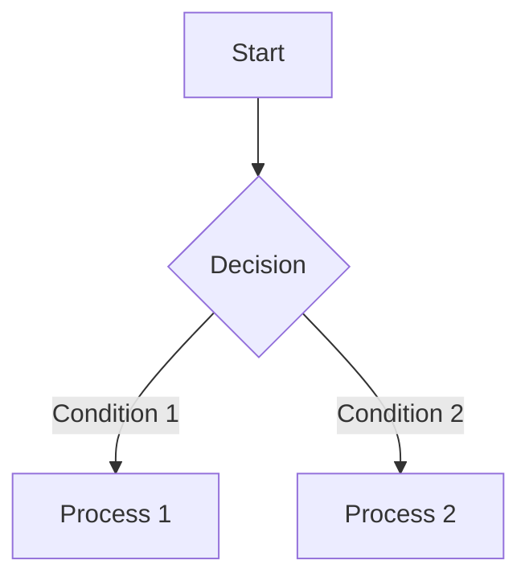

# Features

## Post Management

### Multiple Post Types

Golog supports three post types to meet different recording needs:

| Type    | Name    | Use Case                                   |
| ------- | ------- | ------------------------------------------ |
| blog    | Blog    | Long articles, tech blogs, tutorials       |
| moment  | Moment  | Short updates, life snippets, photo shares |
| whisper | Whisper | Private notes, personal diary              |

### Post Visibility

Each post can be set to one of the following states:

- **Public**: Visible to all visitors
- **Private**: Visible only to logged-in users
- **Password**: Visitors must enter a password to view
- **Draft**: Visible only to the author, for unfinished work
- **Trash**: Soft-deleted state, auto-purged after 24 hours

## Content Rendering

### Markdown Support

Golog uses Goldmark as the public-side Markdown rendering engine, with full GitHub Flavored Markdown (GFM) support.

### Mermaid Diagrams

Draw flowcharts, sequence diagrams, class diagrams, and more directly in posts using Mermaid syntax:

````markdown

````

### LaTeX Math Formulas

Supports inline formulas `$E=mc^2$` and block-level formulas:

```markdown
$$
\sum_{i=1}^{n} x_i = x_1 + x_2 + \cdots + x_n
$$
```

### Table of Contents

Long articles automatically generate a table of contents (TOC) for quick navigation.

## Theme System

### Embedded Themes

All theme resources are embedded into the executable at compile time — no extra static files needed for deployment. Multiple built-in themes are provided, including the default theme and a note-style theme.

### Theme Customization

- Custom header/footer injection code
- Adjustable container width, font family, and font size
- Built-in code highlighting styles

## Admin Panel

### Responsive Admin Interface

The admin panel is designed with mobile-first principles:

- Desktop: Sidebar navigation
- Mobile: Hamburger menu drawer navigation
- Card-style table layout for small screens

### Multi-language Support

Both the admin panel and public themes support internationalization, with built-in Simplified Chinese and other language packs.

## Other Features

- **Tag System**: Add tags to posts for easy categorization and retrieval
- **Image Upload**: Supports cover images and inline post images
- **WebAuthn**: Passwordless login support (Passkey)
- **TLS Support**: Configurable HTTPS certificates for secure access
- **Database Migration**: Built-in CLI migration tool for easy upgrades
- **Auto Cleanup**: Trashed posts are automatically cleaned up on schedule
