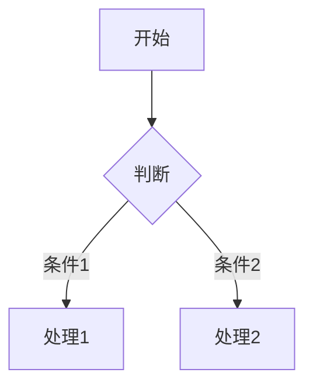

# 功能特性

## 文章管理

### 多种文章类型

Golog 支持三种文章类型，满足不同场景的记录需求：

| 类型    | 名称 | 适用场景                   |
| ------- | ---- | -------------------------- |
| blog    | 随笔 | 长篇文章、技术博客、教程   |
| moment  | 时刻 | 短动态、生活片段、图文分享 |
| whisper | 日志 | 私密记录、个人日记         |

### 文章可见性

每篇文章可以设置为以下状态：

- **公开（public）**：所有访客可见
- **私密（private）**：仅登录用户可见
- **密码保护（password）**：访客需要输入密码才能查看
- **草稿（draft）**：仅作者可见，用于未完成的创作
- **回收站（trash）**：软删除状态，24 小时后自动清理

## 内容渲染

### Markdown 支持

Golog 使用 Goldmark 作为公共端的 Markdown 渲染引擎，完整支持 GitHub Flavored Markdown（GFM）。

### Mermaid 图表

直接在文章中使用 Mermaid 语法绘制流程图、时序图、类图等：

````markdown

````

### LaTeX 数学公式

支持行内公式 `$E=mc^2$` 和块级公式：

```markdown
$$
\sum_{i=1}^{n} x_i = x_1 + x_2 + \cdots + x_n
$$
```

### 目录生成

长篇文章自动生成目录（TOC），方便读者快速导航。

## 主题系统

### 内嵌主题

所有主题资源在编译时内嵌到可执行文件中，部署时无需额外携带静态文件。目前提供多款内置主题，包括默认主题和笔记风格主题。

### 主题定制

- 支持自定义页眉/页脚注入代码
- 可选容器宽度、字体族和字号
- 代码高亮样式内置

## 管理后台

### 响应式管理界面

后台管理面板采用移动优先设计：

- 桌面端：侧边栏导航
- 移动端：汉堡菜单抽屉式导航
- 表格卡片化布局，适配小屏幕

### 多语言支持

管理后台和公共主题均支持国际化，内置简体中文等语言包。

## 其他特性

- **标签系统**：为文章添加标签，便于分类和检索
- **图片上传**：支持封面图和文章内图片上传
- **WebAuthn**：支持无密码登录（Passkey）
- **TLS 支持**：可配置 HTTPS 证书，安全访问
- **数据库迁移**：内置命令行迁移工具，方便升级
- **自动清理**：回收站文章自动定时清理
