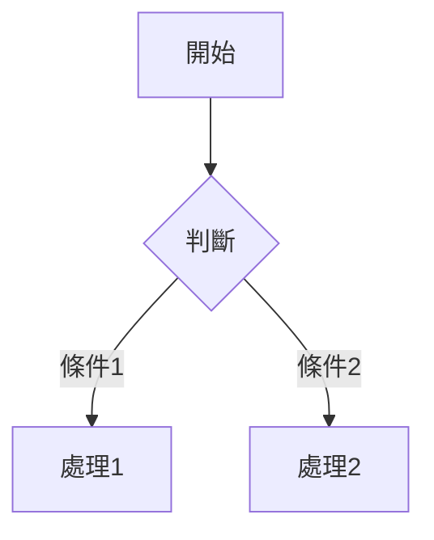

# 功能特性

## 文章管理

### 多種文章類型

Golog 支援三種文章類型，滿足不同場景的記錄需求：

| 類型    | 名稱 | 適用場景                   |
| ------- | ---- | -------------------------- |
| blog    | 隨筆 | 長篇文章、技術部落格、教學 |
| moment  | 時刻 | 短動態、生活片段、圖文分享 |
| whisper | 日誌 | 私密記錄、個人日記         |

### 文章可見性

每篇文章可以設定為以下狀態：

- **公開（public）**：所有訪客可見
- **私密（private）**：僅登入使用者可見
- **密碼保護（password）**：訪客需要輸入密碼才能查看
- **草稿（draft）**：僅作者可見，用於未完成的創作
- **回收站（trash）**：軟刪除狀態，24 小時後自動清理

## 內容渲染

### Markdown 支援

Golog 使用 Goldmark 作為公共端的 Markdown 渲染引擎，完整支援 GitHub Flavored Markdown（GFM）。

### Mermaid 圖表

直接在文章中使用 Mermaid 語法繪製流程圖、時序圖、類別圖等：

````markdown

````

### LaTeX 數學公式

支援行內公式 `$E=mc^2$` 和塊級公式：

```markdown
$$
\sum_{i=1}^{n} x_i = x_1 + x_2 + \cdots + x_n
$$
```

### 目錄生成

長篇文章自動生成目錄（TOC），方便讀者快速導航。

## 主題系統

### 內嵌主題

所有主題資源在編譯時內嵌到可執行檔案中，部署時無需額外攜帶靜態檔案。目前提供多款內建主題，包括預設主題和筆記風格主題。

### 主題定製

- 支援自定義頁首/頁尾注入程式碼
- 可選容器寬度、字體族和字號
- 程式碼高亮樣式內建

## 管理後台

### 響應式管理介面

後台管理面板採用行動優先設計：

- 桌面端：側邊欄導航
- 行動端：漢堡選單抽屜式導航
- 表格卡片化佈局，適配小螢幕

### 多語言支援

管理後台和公共主題均支援國際化，內建簡體中文等語言包。

## 其他特性

- **標籤系統**：為文章新增標籤，便於分類和檢索
- **圖片上傳**：支援封面圖和文章內圖片上傳
- **WebAuthn**：支援無密碼登入（Passkey）
- **TLS 支援**：可設定 HTTPS 憑證，安全存取
- **資料庫遷移**：內建命令列遷移工具，方便升級
- **自動清理**：回收站文章自動定時清理
